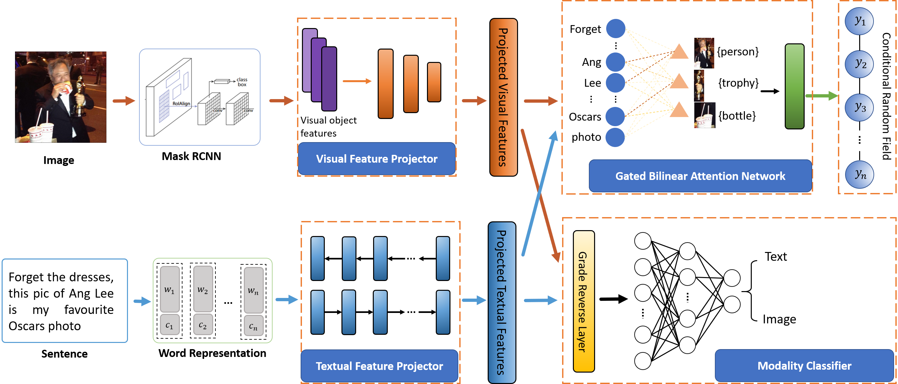

# Source Code of AGBAN for Adversarial Object-aware Multimodal NER Model
Implementation of Our Paper ["Object-aware Multimodal Named Entity Recognition in Social Media Posts with Adversarial Learning"](https://ieeexplore.ieee.org/document/9154571) in IEEE Trans. on Multimedia. This implementation is based on the [NCRF++](https://github.com/jiesutd/NCRFpp).

## Model Architecture

The overall architecture of our model. Our model utilizes the relevant objects as auxiliary contexts for understanding entities in sentences. Adversarial learning is used to bridge the modality gap between text and visual. A gated bilinear attention network is applied to align entities with related visual objects and fuse multimodal information.

## Requirements
* `python >= 3.6`
* `pytorch >= 1.1.0`
* `NCRF++`

## Data Format
* You can download the multimodal dataset from  [twitter2015](https://github.com/jefferyYu/UMT)
* We adopt the glove embeddings to initialize our model which can be downloaded [here](http://nlp.stanford.edu/data/glove.twitter.27B.zip)
* We preprocess the visual contents and extract the object features with [Mask-RCNN](https://github.com/matterport/Mask_RCNN). The preprocessed object feature data can be downloaded [here](https://drive.google.com/file/d/1WTSJS8l1x8s_L2ay5lwWnXV6d5w8G4xz/view?usp=sharing)

## Usage
Set the `status` attribute in demo.train.config to `train` or `decode` , and then

   ```
   python main.py --config demo.train.config
   ```

## Citation
If you find this repo helpful, please cite the following:

```
@article{zheng2020object,
  title={Object-aware Multimodal Named Entity Recognition in Social Media Posts with Adversarial Learning},
  author={Zheng, Changmeng and Wu, Zhiwei and Wang, Tao and Yi, Cai and Li, Qing},
  journal={IEEE Transactions on Multimedia},
  year={2020},
  publisher={IEEE}
}
```


